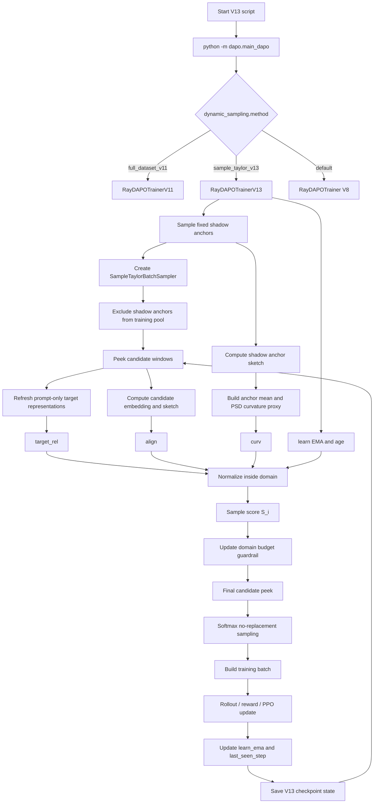

# V11 To V13 Migration Plan For Inner-Network AI

## 0. Goal

Migrate the existing V11 implementation into an isolated V13 workspace and upgrade it from domain-level dynamic sampling to sample-level Taylor-style reweighting.

V11 behavior:

```text
math/code/general weights -> per-domain batch quota -> global pool sampling
```

V13 behavior:

```text
domain budget -> per-domain candidate window -> sample-level Taylor score -> softmax no-replacement sampling
```

Hard requirements:

- Do not modify the original V11 directory.
- Create a standalone `v13` directory.
- Keep the internal Python package name as `dapo`, so execution remains `python -m dapo.main_dapo`.
- Preserve V11 prompt-only target representation.
- Add shadow anchors, sample-level scores, curvature proxy, sample state, V13 checkpoint state, and V13-specific scripts.
- Do not migrate V12 curriculum phase/bucket logic.

## 1. Directory Layout

Create:

```text
/zhdd/home/tjshen/260415_ArcherA100/v13
```

Copy the minimal V11 runtime into V13:

```text
v11/dapo                    -> v13/dapo
v11/tests                   -> v13/tests
v11/tools/model_merge.py    -> v13/tools/model_merge.py
V11 smoke script            -> v13/dynamic_train_v13_a100_smoke_bsz4_20step.sh
```

Do not keep V12 method files in V13:

```text
dapo_ray_trainer_v12.py
curriculum_sampler.py
test_v12_curriculum_sampler.py
```

Expected final tree:

```text
v13/
  dapo/
    dapo_ray_trainer_v8.py
    dapo_ray_trainer_v11.py
    dapo_ray_trainer_v13.py
    dynamic_category_sampler.py
    main_dapo.py
    sample_taylor_sampler.py
  tests/
    test_v13_sample_taylor_sampler.py
    test_v13_isolation_and_dispatch.py
  docs/
    v13_technical_report.md
    v13_implementation_audit.md
    v13_code_correspondence_report.md
  tools/
    model_merge.py
    model_merge.sh
  worker_patch/
    fsdp_workers.py
  dynamic_train_v13_a100_smoke_bsz4_20step.sh
  dynamic_train_v13_a100_formal.sh
```

## 2. Modify `dapo/main_dapo.py`

Inside the V13 copy only, import V8 as the default trainer:

```python
from .dapo_ray_trainer_v8 import RayDAPOTrainer
```

Add V13 method dispatch:

```python
elif dynamic_method == "sample_taylor_v13":
    from .dapo_ray_trainer_v13 import RayDAPOTrainerV13

    print("[V13] Using RayDAPOTrainerV13 with sample_taylor_v13 method")
    trainer = RayDAPOTrainerV13(
        config=config,
        tokenizer=tokenizer,
        processor=processor,
        role_worker_mapping=role_worker_mapping,
        resource_pool_manager=resource_pool_manager,
        ray_worker_group_cls=ray_worker_group_cls,
        reward_fn=reward_fn,
        val_reward_fn=val_reward_fn,
        device_name=config.trainer.device,
    )
```

Keep valid branches:

```text
default -> RayDAPOTrainer V8
full_dataset_v11 -> RayDAPOTrainerV11
sample_taylor_v13 -> RayDAPOTrainerV13
```

Remove invalid or unrelated branches from the V13 copy:

```text
prototype_dual_value
full_dataset_v12
```

## 3. Add `dapo/sample_taylor_sampler.py`

Add:

```python
class SampleTaylorBatchSampler:
```

Responsibilities:

- Build per-domain index pools.
- Support `exclude_indices` so shadow anchors do not enter the training pool.
- Convert domain weights into integer batch quotas.
- `peek_candidates()` returns per-domain candidate windows without consuming samples.
- `sample_batch()` uses sample scores for softmax no-replacement sampling.
- Unselected candidate samples remain available for later windows.
- Support `state_dict()` and `load_state_dict()`.

Required constructor parameters:

```python
dataset
batch_size
seed
categories
candidate_multiplier
sample_softmax_temperature
domain_min_weight
exclude_indices
```

Core behavior:

```text
domain_weights -> target_counts
target_counts -> candidate windows
sample_scores -> softmax no-replacement draw
selected samples -> consumed from pool
unselected candidates -> kept in pool
```

## 4. Add `dapo/dapo_ray_trainer_v13.py`

V13 trainer must inherit V11:

```python
class RayDAPOTrainerV13(RayDAPOTrainerV11):
```

### 4.1 State

Add these fields:

```python
self._v13_shadow_anchor_indices
self._v13_sample_learn_ema
self._v13_sample_last_seen_step
self._v13_curvature_matrix_ema
self._v13_anchor_mean_sketch
self._v13_projection_matrix
self._v13_target_representations_cache
self._v13_target_representations_step
self._v13_anchor_refresh_step
self._v13_domain_budget
```

### 4.2 Shadow Anchor

Before creating the main sampler, sample fixed shadow anchors from the full training set by domain.

Requirements:

- At most `shadow_anchor_size_per_domain` samples per domain.
- Leave at least one sample in the training pool for small smoke datasets.
- Exclude shadow anchors from the main sampler through `exclude_indices`.
- Save shadow anchors in checkpoint.
- Restore shadow anchors on resume.

### 4.3 Target Representation

Reuse V11 prompt-only target representation.

Allowed fields:

```text
prompt
instruction
question
content
input
```

Forbidden fields:

```text
answer
output
ground_truth
solution
```

V13 may add a target representation cache:

```python
target_repr_refresh_freq
```

### 4.4 Sample-Level Score

For every candidate sample, compute:

```text
target_rel_i
align_i
learn_i
curv_i
age_i
```

Meaning:

```text
target_rel_i = cosine(candidate_embedding, target_representation)
align_i      = dot(candidate_sketch, shadow_anchor_mean_sketch)
learn_i      = sample reward EMA
curv_i       = z_i^T C z_i
age_i        = global_step - last_seen_step
```

Normalize each component inside its domain, then combine:

```python
score = (
    w_target_rel * norm_target_rel
    + w_align * norm_align
    + w_learn * norm_learn
    - w_curv * norm_curv
    + w_age * norm_age
)
```

Default weights:

```text
target_rel = 1.0
align      = 1.0
learn      = 0.5
curv       = 0.5
age        = 0.05
```

### 4.5 Curvature Proxy

From shadow anchor sketches:

```python
C = Z.T @ Z / len(Z)
C = 0.5 * (C + C.T)
```

EMA update:

```python
C_ema = decay * C_ema + (1 - decay) * C
```

Sample curvature:

```python
curv_i = z_i.T @ C_ema @ z_i
```

This is a sketch-space PSD curvature proxy. It is not a full-parameter Hessian.

### 4.6 Domain Budget Guardrail

V13 keeps domain weights as a guardrail, not as the primary controller.

Flow:

```text
current_weights -> initial candidate peek
candidate score top-mean -> update domain budget
new domain budget -> final candidate peek
final sample scores -> sample_batch
```

Budget update:

```python
proposed = softmax(top_mean_scores / domain_temperature)
mixed = (1 - gamma) * old_budget + gamma * proposed
mixed = apply_min_weight_floor(mixed)
```

Defaults:

```text
domain_budget_smooth = 0.2
domain_min_weight = 0.15
domain_softmax_temperature = 1.0
```

### 4.7 Sample State Update

After reward computation, aggregate by `uid` and update by `v13_dataset_index`:

```python
learn_ema[idx] = (1 - decay) * old + decay * avg_rule_reward
last_seen_step[idx] = global_step
```

Default:

```text
learn_ema_decay = 0.2
```

### 4.8 Checkpoint

Extend V11 dynamic checkpoint with:

```text
v13_shadow_anchor_indices
v13_sample_learn_ema
v13_sample_last_seen_step
v13_projection_seed
v13_curvature_matrix_ema
v13_anchor_mean_sketch
v13_domain_budget
sampler_state
current_weights
category_rewards
```

Resume must restore these values.

## 5. Worker Patch

Inside V13 `worker_patch/fsdp_workers.py`, add:

```python
compute_v13_repr_and_grad_sketch
```

Return:

```text
next_token_embeddings
grad_sketch
```

Proxy implementation:

```text
sketch_source = next_token_embedding - target_embedding
grad_sketch = sketch_source @ fixed_random_projection
```

Requirements:

- Fixed projection seed.
- Configurable projection dimension.
- Return tensors on CPU.
- Keep the interface stable so a future strict gradient implementation can replace internals only.

Important caveat to document:

```text
Current grad_sketch is residual projection proxy.
It is not exact lm_head + last-layer per-parameter gradient.
```

## 6. Training Scripts

### 6.1 Smoke Script

Create:

```text
dynamic_train_v13_a100_smoke_bsz4_20step.sh
```

Required path variables:

```bash
BASE_DIR=/zhdd/home/tjshen/260415_ArcherA100
WORK_DIR="${BASE_DIR}/v13"
RUNTIME_DIR="${BASE_DIR}/runtime_v13"
RAY_TMPDIR="${BASE_DIR}/r_v13"
OUTPUT_ROOT=${OUTPUT_ROOT:-./output_v13}
DYNAMIC_METHOD=${DYNAMIC_METHOD:-sample_taylor_v13}
```

Default smoke parameters:

```bash
TOTAL_TRAINING_STEPS=${TOTAL_TRAINING_STEPS:-20}
SAVE_FREQ=${SAVE_FREQ:-10}
TRAIN_PROMPT_BSZ=${TRAIN_PROMPT_BSZ:-4}
SHADOW_ANCHOR_SIZE_PER_DOMAIN=${SHADOW_ANCHOR_SIZE_PER_DOMAIN:-8}
GRAD_PROJECTION_DIM=${GRAD_PROJECTION_DIM:-64}
CURVATURE_REFRESH_FREQ=${CURVATURE_REFRESH_FREQ:-10}
```

Add Hydra parameters:

```bash
+trainer.dynamic_sampling.method=${DYNAMIC_METHOD}
+trainer.dynamic_sampling.shadow_anchor_size_per_domain=${SHADOW_ANCHOR_SIZE_PER_DOMAIN}
+trainer.dynamic_sampling.candidate_multiplier=${CANDIDATE_MULTIPLIER}
+trainer.dynamic_sampling.grad_projection_dim=${GRAD_PROJECTION_DIM}
+trainer.dynamic_sampling.grad_projection_seed=${GRAD_PROJECTION_SEED}
+trainer.dynamic_sampling.sample_softmax_temperature=${SAMPLE_SOFTMAX_TEMPERATURE}
+trainer.dynamic_sampling.domain_softmax_temperature=${DOMAIN_SOFTMAX_TEMPERATURE}
+trainer.dynamic_sampling.domain_min_weight=${DOMAIN_MIN_WEIGHT}
+trainer.dynamic_sampling.learn_ema_decay=${LEARN_EMA_DECAY}
+trainer.dynamic_sampling.curvature_refresh_freq=${CURVATURE_REFRESH_FREQ}
+trainer.dynamic_sampling.sample_score_weights.target_rel=${SAMPLE_SCORE_TARGET_REL:-1.0}
+trainer.dynamic_sampling.sample_score_weights.align=${SAMPLE_SCORE_ALIGN:-1.0}
+trainer.dynamic_sampling.sample_score_weights.learn=${SAMPLE_SCORE_LEARN:-0.5}
+trainer.dynamic_sampling.sample_score_weights.curv=${SAMPLE_SCORE_CURV:-0.5}
+trainer.dynamic_sampling.sample_score_weights.age=${SAMPLE_SCORE_AGE:-0.05}
```

### 6.2 Formal Script

Create:

```text
dynamic_train_v13_a100_formal.sh
```

Defaults:

```bash
PROJECT_NAME=ArcherCodeR-V13-A100
EXP_NAME=train_v13_a100_sample_taylor_save100
OUTPUT_ROOT=./output_v13
DYNAMIC_METHOD=sample_taylor_v13
TOTAL_TRAINING_STEPS=1000
SAVE_FREQ=100
TRAIN_PROMPT_BSZ=32
TRAIN_PROMPT_MINI_BSZ=8
SHADOW_ANCHOR_SIZE_PER_DOMAIN=128
GRAD_PROJECTION_DIM=256
CURVATURE_REFRESH_FREQ=50
```

The formal script may call the smoke script after overriding environment variables.

## 7. Merge Tool

Keep:

```text
tools/model_merge.py
```

Create:

```text
tools/model_merge.sh
```

Implementation:

```bash
#!/bin/bash
set -euo pipefail

if [ $# -lt 1 ]; then
    echo "Usage: $0 /path/to/run/global_step_xxx [target_dir]" >&2
    exit 2
fi

checkpoint_dir="$1"
target_dir="${2:-${checkpoint_dir}_merged}"
model_path="${checkpoint_dir}/actor"

python -m tools.model_merge merge \
    --backend fsdp \
    --local_dir "${model_path}" \
    --target_dir "${target_dir}"
```

## 8. Tests

Create:

```text
tests/test_v13_sample_taylor_sampler.py
tests/test_v13_isolation_and_dispatch.py
```

Required coverage:

```text
High-score samples are preferred.
Unselected candidates are not consumed.
Sampler state round trip works.
Domain minimum budget is enforced.
Shadow anchor exclude works.
V13 dispatch only exists in the V13 copy.
V13 scripts use v13/runtime_v13/r_v13/output_v13 paths.
V12 curriculum modules are not present.
Technical report exists.
```

Verification:

```bash
python -m compileall dapo tests worker_patch tools
```

If `pytest` is available:

```bash
python -m pytest tests -q
```

If `pytest` is unavailable, run a small manual test runner that imports both V13 test files and calls every function whose name starts with `test_`.

## 9. Documentation

Create:

```text
docs/v13_technical_report.md
docs/v13_implementation_audit.md
docs/v13_code_correspondence_report.md
```

Each report should include:

```text
V13 method goal
Taylor relationship
Code-location correspondence
Implemented items
Partially implemented items
Missing items
Extra-module check
Verification commands and results
```

Must explicitly state:

```text
worker grad_sketch is currently residual projection proxy,
not exact lm_head + last-layer per-parameter gradient sketch.
```

## 10. Flowchart



## 11. Acceptance Checklist

```text
[ ] `v13` directory exists independently.
[ ] Original V11 directory is not modified.
[ ] `main_dapo.py` dispatches `sample_taylor_v13`.
[ ] `dapo_ray_trainer_v13.py` exists.
[ ] `sample_taylor_sampler.py` exists.
[ ] Shadow anchors are fixed.
[ ] Shadow anchors are excluded from the main training pool.
[ ] Prompt-only target representation still uses V11 logic.
[ ] Sample score includes target_rel / align / learn / curv / age.
[ ] Sampler supports candidate peek and softmax no-replacement sampling.
[ ] V13 checkpoint saves sample state and curvature state.
[ ] V13 logs `dynamic/v13_*` metrics.
[ ] Smoke script writes to `output_v13`.
[ ] Formal script saves every 100 steps by default.
[ ] Merge script works.
[ ] V12 curriculum modules are not mixed into V13.
[ ] Technical report and implementation audit are archived.
[ ] `compileall` passes.
[ ] Unit tests or manual runner pass.
[ ] Remote 20-step smoke run completes.
[ ] Checkpoint resume preserves shadow anchor and sampler exclude consistency.
```

## 12. Things Not To Do

Do not:

```text
Modify the original V11 directory.
Migrate V12 phase/bucket curriculum into V13.
Use test answers or benchmark scores as controller signals.
Use format fail / KL spike / overlong as main control signals.
Claim residual projection sketch is exact Hessian parameter gradient.
Keep unrelated tool scripts or old experiment branches in V13.
```
