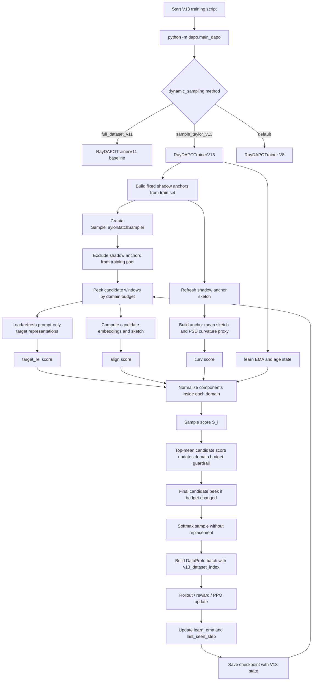

# V13 Code-Correspondence Technical Report

## 1. Executive Summary

本报告对应当前 `v13` 目录中的实际代码，而不是只复述设计方案。审计对象包括入口分发、V13 trainer、样本级 sampler、worker patch、训练脚本、merge 工具、测试和多余模块清理。

结论：

- V13 已经从 V11 独立出来，代码目录和输出路径均独立。
- 主采样逻辑已经从 V11 的“领域权重 -> 全局池抽样”升级为“领域预算 -> 候选窗口 -> 样本级 Taylor 分数 -> softmax 无放回抽样”。
- shadow anchor、样本状态、曲率代理、V13 checkpoint 和 V13 日志都已接入。
- 当前 worker sketch 是 target-conditioned residual projection sketch，不是严格的 `lm_head + last layer` per-parameter gradient sketch。这是唯一核心理论偏差。
- 审计时发现并修复了一个入口问题：`main_dapo.py` 原先引用不存在的 `dapo_ray_trainer.py`，并保留了缺失 V10 文件的旧分支；当前已改为导入 `dapo_ray_trainer_v8`，并移除该旧分支。

## 2. Directory And Isolation

代码位置：

- `dapo/dapo_ray_trainer_v8.py`
- `dapo/dapo_ray_trainer_v11.py`
- `dapo/dapo_ray_trainer_v13.py`
- `dapo/dynamic_category_sampler.py`
- `dapo/main_dapo.py`
- `dapo/sample_taylor_sampler.py`
- `worker_patch/fsdp_workers.py`
- `tools/model_merge.py`
- `tools/model_merge.sh`
- `dynamic_train_v13_a100_smoke_bsz4_20step.sh`
- `dynamic_train_v13_a100_formal.sh`
- `tests/test_v13_sample_taylor_sampler.py`
- `tests/test_v13_isolation_and_dispatch.py`

检查结果：

- 原始 V11 目录中没有出现 `sample_taylor_v13`、`RayDAPOTrainerV13`、`SampleTaylorBatchSampler`。
- V13 目录中删除了 V12 课程学习模块：`dapo_ray_trainer_v12.py` 和 `curriculum_sampler.py` 不存在。
- V13 目录没有保留无关工具脚本，仅保留模型 merge 必需的 `model_merge.py` 和 `model_merge.sh`。

审计结论：隔离策略正确，未发现 V11 被污染。

## 3. Entry Dispatch

对应代码：

- `dapo/main_dapo.py:13`
- `dapo/main_dapo.py:133`
- `dapo/main_dapo.py:134`
- `dapo/main_dapo.py:149`
- `dapo/main_dapo.py:150`
- `dapo/main_dapo.py:153`

当前实现：

- 默认 trainer 从 `dapo_ray_trainer_v8` 导入。
- `dynamic_sampling.method=full_dataset_v11` 分发到 `RayDAPOTrainerV11`。
- `dynamic_sampling.method=sample_taylor_v13` 分发到 `RayDAPOTrainerV13`。
- V12 分支和旧 V10 分支都不在 V13 主入口中。

检查结果：

- 入口现在只保留 V8 default、V11 baseline、V13 method 三条有效路径。
- 修复了此前 V13 副本中导入不存在 `dapo_ray_trainer.py` 的问题。

审计结论：入口分发与 V13 目标一致。

## 4. SampleTaylorBatchSampler

对应代码：

- `dapo/sample_taylor_sampler.py:13`
- `dapo/sample_taylor_sampler.py:22`
- `dapo/sample_taylor_sampler.py:72`
- `dapo/sample_taylor_sampler.py:98`
- `dapo/sample_taylor_sampler.py:124`
- `dapo/sample_taylor_sampler.py:181`
- `dapo/sample_taylor_sampler.py:203`
- `dapo/sample_taylor_sampler.py:253`
- `dapo/sample_taylor_sampler.py:273`

当前实现：

- 初始化时按 `math/code/general` 建立领域索引，并通过 `exclude_indices` 排除 shadow anchor。
- `_normalize_domain_weights` 对领域预算做非负化、归一化和最小预算下界。
- `_allocate_target_counts` 将连续领域预算转成整数 batch quota。
- `peek_candidates` 只查看候选窗口，不消费池子。
- `sample_batch` 对候选窗口按 `sample_scores` 做 softmax 无放回采样。
- 未被选中的候选样本保留在 `remaining_orders` 中。
- `state_dict/load_state_dict` 保存/恢复池状态、随机数状态、温度、候选倍数、领域下界和排除集。

测试覆盖：

- `tests/test_v13_sample_taylor_sampler.py:34` 检查高分样本优先且未选候选保留。
- `tests/test_v13_sample_taylor_sampler.py:56` 检查 sampler 状态可恢复。
- `tests/test_v13_sample_taylor_sampler.py:72` 检查领域最小预算。
- `tests/test_v13_sample_taylor_sampler.py:92` 检查 `peek_candidates` 不消费池。
- `tests/test_v13_sample_taylor_sampler.py:104` 检查 shadow anchor 排除。

审计结论：采样器已经实现样本级主控制和领域预算护栏。

注意点：

- softmax 采样仍有随机性；温度很低时接近贪心，但不是严格 top-k。
- 如果某个领域被 shadow anchor 排除后完全没有剩余样本，该领域会从 sampler 的 `categories` 中消失。

## 5. Shadow Anchor

对应代码：

- `dapo/dapo_ray_trainer_v13.py:83`
- `dapo/dapo_ray_trainer_v13.py:106`

当前实现：

- `_create_global_category_pool_sampler` 先从完整训练集构造领域索引。
- `_v13_init_shadow_anchor_indices` 每个领域固定抽取 shadow anchor。
- sampler 构造时将 shadow anchor 传入 `exclude_indices`，避免进入主训练池。
- 小数据 smoke 场景会给每个领域至少留一个训练样本。

审计结论：shadow anchor 已固定，且不参与主训练采样。

风险：

- 恢复训练时，如果先构造 sampler 再加载旧 checkpoint 中的 shadow anchor，可能出现“sampler 排除集来自新抽样、trainer 状态来自旧抽样”的不一致风险。当前代码保存/加载了 anchor，但需要在真实 resume 流程中进一步跑一次端到端恢复测试确认调用顺序。

## 6. Target Representation

对应代码：

- `dapo/dapo_ray_trainer_v13.py:199`
- 继承自 `dapo/dapo_ray_trainer_v11.py` 的 prompt-only target 读取和 next-token embedding 表征逻辑

当前实现：

- V13 复用 V11 的 target 表征构建。
- target files 默认仍是 math/code/general 三个 prompt-only 文件。
- `_v13_get_target_representations` 增加了缓存和刷新频率。

审计结论：target 表征链路与 V11 一致，没有引入测试答案字段。

注意点：

- target 表征仍来自当前模型 forward，因此刷新会有额外推理开销。
- V13 的 target cache 会降低频繁重算开销，但也意味着两个刷新点之间的 target 表征不是每步最新。

## 7. Sample Score Computation

对应代码：

- `dapo/dapo_ray_trainer_v13.py:237`
- `dapo/dapo_ray_trainer_v13.py:267`
- `dapo/dapo_ray_trainer_v13.py:337`

当前实现：

- `_v13_get_repr_and_grad_sketch` 为候选样本取 embedding 和 sketch。
- `_v13_maybe_refresh_anchor_statistics` 从 shadow anchor sketch 计算：
  - `anchor_mean_sketch`
  - PSD curvature proxy `C = Z^T Z / n`
  - EMA curvature matrix
- `_v13_compute_candidate_scores` 计算：
  - `target_rel`: 候选 embedding 与对应 target representation 的 cosine 相似度
  - `align`: 候选 sketch 与 anchor mean sketch 的内积
  - `curv`: `z_i^T C z_i`
  - `learn`: 样本 reward EMA，未见样本用领域均值或 0.5
  - `age`: 当前 step 与 last seen step 的间隔
- 所有分量在领域内标准化后合成最终 `sample_scores`。

审计结论：样本级分数五项均已落地。

关键偏差：

- 理论计划里的一阶/二阶项希望来自参数梯度 sketch；当前 worker 默认 sketch 是 representation residual projection。它可作为 target-conditioned proxy，但不是严格 Hessian/Taylor 参数空间项。

## 8. Domain Budget Guardrail

对应代码：

- `dapo/dapo_ray_trainer_v13.py:430`
- `dapo/dapo_ray_trainer_v13.py:458`

当前实现：

- `_v13_budget_weights` 输入 V11 的 `current_weights` 和候选样本 top-mean score。
- 通过 softmax 得到 proposed domain budget。
- 用 `domain_budget_smooth` 与历史 budget 平滑。
- 用 `domain_min_weight` 设置领域预算下界。
- `_build_dynamic_batch` 先 peek 一次候选，计算 score，再更新 budget，然后根据最终 budget 重新 peek 和打分，最后采样。

审计结论：领域权重已经降级为预算护栏，样本分数负责最终抽样。

注意点：

- V13 的 `dynamic/v13_weight_*` 记录的是 sampler 最终归一化权重，不完全等于 V11 的 `dynamic/weight_*`。
- `_build_dynamic_batch` 最多会为同一步候选做两次 scoring，算力开销高于 V11。

## 9. Sample State And Checkpoint

对应代码：

- `dapo/dapo_ray_trainer_v13.py:126`
- `dapo/dapo_ray_trainer_v13.py:151`
- `dapo/dapo_ray_trainer_v13.py:519`

当前实现：

- `_save_checkpoint` 在继承 V11/V8 动态状态后追加 V13 状态。
- `_maybe_load_dynamic_state` 恢复 V13 状态。
- `_update_dynamic_sample_observables` 用 `v13_dataset_index` 和 `uid` 聚合 reward，更新：
  - `sample_learn_ema`
  - `sample_last_seen_step`

审计结论：样本 learnability 和 age 状态已实现，V13 状态已进入 checkpoint。

风险：

- 如第 5 节所述，shadow anchor 与 sampler exclude set 的 resume 一致性需要真实 checkpoint 恢复测试。
- 当前没有单独的 trainer-level 单元测试覆盖 `_update_dynamic_sample_observables`，测试主要覆盖 sampler 和入口。

## 10. Worker Patch

对应代码：

- `worker_patch/fsdp_workers.py:709`
- `worker_patch/fsdp_workers.py:789`
- `worker_patch/fsdp_workers.py:818`
- `worker_patch/fsdp_workers.py:820`

当前实现：

- `compute_next_token_embeddings` 提供 V11/V13 共用 embedding。
- `compute_v13_repr_and_grad_sketch` 返回：
  - `next_token_embeddings`
  - `grad_sketch`
- 如果传入 `v13_target_embeddings`，sketch source 是 `next_token_embeddings - target_embeddings`。
- 再用固定随机投影得到 `grad_sketch`。

审计结论：worker RPC 接口已实现，可服务 V13 trainer。

关键偏差：

- 名称叫 `grad_sketch`，但当前不是实际参数梯度。
- 当前实现没有显式选择 `lm_head + last transformer block` 参数，也没有做 autograd per-sample gradient。
- 因此这版 V13 是“可运行的 proxy sketch 版”，不是严格“参数 Hessian 二阶项”完整版。

## 11. Scripts And Tools

对应代码：

- `dynamic_train_v13_a100_smoke_bsz4_20step.sh:6`
- `dynamic_train_v13_a100_smoke_bsz4_20step.sh:7`
- `dynamic_train_v13_a100_smoke_bsz4_20step.sh:16`
- `dynamic_train_v13_a100_smoke_bsz4_20step.sh:107`
- `dynamic_train_v13_a100_smoke_bsz4_20step.sh:120`
- `dynamic_train_v13_a100_smoke_bsz4_20step.sh:253`
- `dynamic_train_v13_a100_formal.sh:10`
- `dynamic_train_v13_a100_formal.sh:11`
- `dynamic_train_v13_a100_formal.sh:12`
- `tools/model_merge.sh:14`

当前实现：

- smoke 脚本使用 `/zhdd/home/tjshen/260415_ArcherA100/v13`。
- runtime 和 Ray tmp 都切到 V13 专属路径。
- 输出默认到 `./output_v13`。
- 默认 method 是 `sample_taylor_v13`。
- formal 脚本复用 smoke 脚本，但默认 `TOTAL_TRAINING_STEPS=1000`、`SAVE_FREQ=100`。
- merge 脚本用 `python -m tools.model_merge merge`。

审计结论：运行路径已独立化。

注意点：

- smoke 脚本仍使用 `ray stop --force`，会影响当前机器上的 Ray 会话；这继承自 V11/V12 脚本习惯。
- 这次只做了本地代码级检查，没有在远端 A100 上实际启动训练。

## 12. Tests

对应代码：

- `tests/test_v13_sample_taylor_sampler.py`
- `tests/test_v13_isolation_and_dispatch.py`

覆盖内容：

- 高分样本被优先采样。
- 未选候选不被消费。
- sampler state round trip。
- 领域最小预算。
- shadow anchor exclude。
- V13 入口只在 V13 副本中存在。
- V13 脚本使用独立路径。
- 技术报告存在。
- V12 curriculum 模块未保留。

审计结论：当前测试覆盖了 sampler 和隔离/入口行为。

缺口：

- 没有 Ray/FSDP worker 真实 RPC 测试。
- 没有真实 checkpoint resume 测试。
- 没有小步数端到端训练 smoke 结果。

## 13. Flowchart

## 14. Final Audit Verdict

已实现：

- 独立 V13 目录
- V13 入口
- 样本级候选窗口采样器
- shadow anchor 固定与排除
- target prompt-only 表征复用
- 样本分数五项
- PSD curvature proxy
- 领域预算护栏
- 样本状态更新
- V13 checkpoint 扩展
- V13 smoke/formal/merge 脚本
- 技术报告和实现审计留档
- V12 curriculum 模块清理

部分实现：

- worker `grad_sketch` 当前是 residual projection proxy，不是严格 `lm_head + last layer` per-parameter gradient sketch。

未完成但建议下一步做：

- 远端 A100 小步数端到端 smoke。
- checkpoint resume 后验证 shadow anchor 与 sampler exclude set 一致。
- worker 端升级为真实参数梯度 sketch，并增加 Ray RPC 测试。
